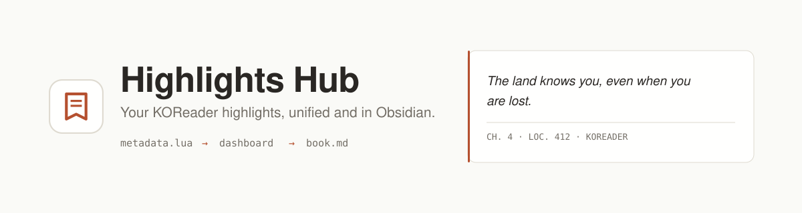

<p align="center">
  <picture>
    <source media="(prefers-color-scheme: dark)" srcset=".github/banner-dark.svg">
    
  </picture>
</p>

<p align="center">
  Web app that imports highlights and annotations from <strong>KOReader</strong>, unifies
  them in a dashboard, and exports them as <strong>Obsidian-flavored Markdown</strong>.
  <br>
  Built for readers who use Obsidian as a second brain and want their highlights there
  without manual work.
</p>

<p align="center">
  <a href="docs/deploy-self-hosted.md"><strong>Self-host it</strong></a>
  ·
  <a href="docs/deploy-hosted.md">Deploy to Vercel</a>
  ·
  <a href="plugins/hub.koplugin/README.md">KOReader plugin</a>
</p>

## How it works

1. **Import** — upload a KOReader `metadata.<ext>.lua`, standalone
   `<book>.<ext>.annotations.lua`, or `statistics.sqlite3` (drag & drop, or let the
   [KOReader plugin](plugins/hub.koplugin/README.md) sync automatically in the
   background).
2. **Unify** — highlights, reading stats, and covers land in one dashboard, deduped
   across re-uploads, taggable, searchable.
3. **Export** — one book as `.md`, or everything as a `.zip`, formatted as Obsidian
   `> [!quote]` callouts with frontmatter.

See [`CLAUDE.md`](CLAUDE.md) for stack and architecture details.

## Local development (Supabase in Docker)

No hosted Supabase project needed to develop locally. The Supabase CLI (installed as a
devDependency) drives a local Docker stack (Postgres, Auth, Storage, Studio) based on
`supabase/config.toml`.

Prerequisite: Docker must be running (Docker Desktop with WSL integration, or Docker
Engine directly in WSL — either works, the CLI manages its own containers). This is a
*development* stack and is separate from the production self-hosting stack in
[`docker/`](docker/) — `supabase/config.toml` governs only the former.

```bash
npm install
npm run supabase:start   # starts the local stack, prints API URL / anon key / service_role key / DB URLs
```

Copy `.env.example` to `.env` and fill it in with the values printed above (re-check
anytime with `npm run supabase:status`):

- `NEXT_PUBLIC_SUPABASE_URL` → the API URL (e.g. `http://127.0.0.1:54321`)
- `NEXT_PUBLIC_SUPABASE_PUBLISHABLE_KEY` → the publishable/anon key
- `SUPABASE_SECRET_KEY` → the service_role key
- `DATABASE_URL` → the pooled connection string (port 6543, `?pgbouncer=true`)
- `DIRECT_URL` → the direct connection string (port 5432, used for migrations)
- `SITE_URL` → the origin your browser actually uses to reach the app (the allow-list
  Auth redirects are checked against)

Then apply the Prisma schema and start the app:

```bash
npx prisma migrate dev
npm run dev
```

Create an account at `/signup` — sign-in is email + password with no email
confirmation step, so signing up and in never leaves the machine.

Supabase Studio (local dashboard) runs at `http://127.0.0.1:54323`. Password
recovery is the one flow that does send mail; locally it lands in the Inbucket test
inbox at `http://127.0.0.1:54324` instead of a real address.

Stop the stack with `npm run supabase:stop` when you're done (data persists across
restarts; only `supabase stop --no-backup` or `supabase db reset` wipe it).

## Deploying to production

Everything above runs against the local dev stack. To serve real users, pick one of two
paths — same app code, same Prisma schema, same auth either way. Only who runs the
infrastructure changes.

### [Self-hosted](docs/deploy-self-hosted.md) — everything in Docker, on your machine

```bash
cp docker/.env.example docker/.env    # fill it in — read the URL section first
docker compose -f docker/docker-compose.yml --env-file docker/.env up -d --build
```

App, Postgres, Auth, and Storage in one compose file, behind a single origin. Only one
port is published, and your highlights never leave hardware you control. You take on
backups and updates in exchange. The KOReader plugin works over plain `http://` on a
private network, so no certificate is needed to get started.

### [Vercel + Supabase Cloud](docs/deploy-hosted.md) — nothing to run yourself

No servers to patch, no backups to schedule — at the cost of your reading data living
on someone else's infrastructure. The fastest way to a real deployment.

## KOReader plugin

For automatic background sync straight from your e-reader instead of manual uploads,
see [`plugins/hub.koplugin/README.md`](plugins/hub.koplugin/README.md).

## Commands

```bash
npm run supabase:start   # start local Supabase stack
npm run supabase:status  # print local API URL / anon key / service_role key / DB URLs
npm run supabase:stop    # stop the local Supabase stack
npm run dev               # dev server
npx prisma migrate dev   # apply migrations in dev
npx prisma studio        # inspect the database visually
npx prisma generate      # regenerate the client after changing the schema
npm run test              # unit tests
npm run test:integration:db # destructive, isolated local Supabase DB tests (requires Docker)
npm run test:mutation:lua # curated Lua mutations, using the existing Fengari test runtime
npm run build             # production build
npm run lint               # lint
```

The database integration command starts its own `hub-integration` Supabase Postgres
on port `55322`, deploys the Prisma migrations, runs the persisted-invariant suite,
and removes that test database afterward. It is manual and local only: it does not
connect to a hosted Supabase project and is not part of the regular test command or CI.
The Lua mutation command installs nothing; it writes mutants to the operating system's
temporary directory and runs them through the Fengari dependency already in the repo.

## Support

If you enjoyed the project, you can leave a small donation on Ko-fi.

<a href='https://ko-fi.com/juulius' target='_blank'></a>
